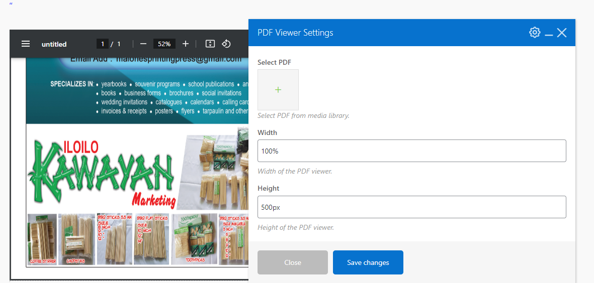

# PDF Viewer for WPBakery

Embed a PDF viewer in WPBakery and select a PDF from the media library.

## Description

This plugin allows you to easily embed a PDF viewer into your WPBakery pages/posts. You can either select a PDF from the media library. The plugin uses Viewer.js to render the PDF viewer.

## Installation

1. Upload the `pdf-viewer-for-wpbakery` folder to the `/wp-content/plugins/` directory.
2. Activate the plugin through the 'Plugins' menu in WordPress.
3. Use the PDF Viewer element in WPBakery to embed a PDF viewer into your pages/posts.

## Usage

To embed a PDF viewer using the WPBakery element:

1. Go to the page/post where you want to embed the PDF viewer.
2. Click on the "+" button to add a new element.
3. Search for "PDF Viewer" and add it to your page.
4. Set the width and height of the PDF viewer as desired.
5. Click "Save Changes" to save your page/post.

## Features

- Embed a PDF viewer into WPBakery pages/posts.
- Select a PDF from the media library or manually input a PDF URL.
- Set the width and height of the PDF viewer.
- Uses Viewer.js to render the PDF viewer.

## Screenshots

## Support

For support or feature requests, please [open an issue]([https://github.com/FuryPW/PDF-Viewer-Plugin/issues/new]).

## License

This project is licensed under the MIT License - see the [LICENSE](LICENSE) file for details.
